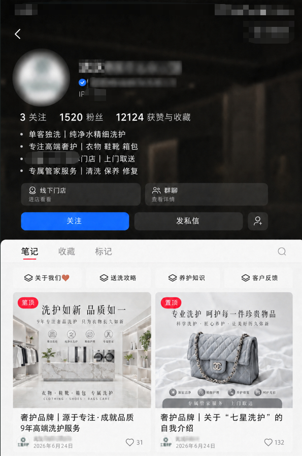
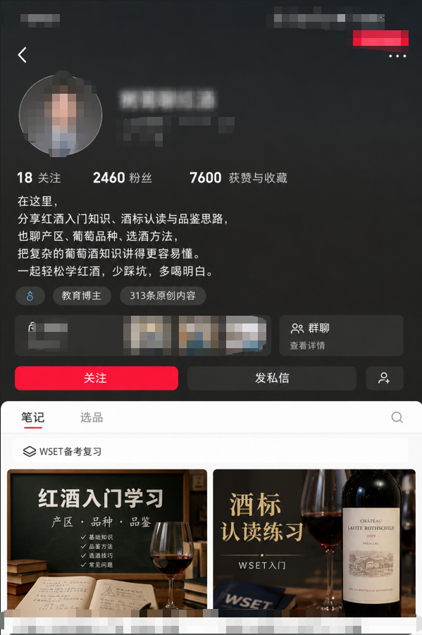

# Redbook MCP Easy

Redbook MCP Easy 是一个面向小红书运营场景的 Windows 桌面软件。下载安装后即可在本地启动 MCP 服务，可直接让 AI 直接操作或可视化界面完成账号登录、功能测试和内容发布。

> 关键词：安装即用、本地运行、账号矩阵、MCP、AI 自动化、小红书运营。

## 为什么选择 Redbook MCP Easy？

- **安装即用**：下载 Windows 安装包，按提示安装即可使用，不需要懂代码，使用简单。
- **本地运行，账号数据自持**：账号登录态、授权信息和运行数据保存在用户本机，减少云端依赖。
- **AI 可直接调用小红书能力**：内置 MCP 服务，让支持 MCP 的 AI 客户端直接调用小红书工具。
- **覆盖运营全流程**：支持搜索、读取、互动、草稿、发布等常见小红书运营动作。
- **账号矩阵管理**：支持多账号登录、切换和管理，可分别查看各账号草稿状态的笔记，适合矩阵号运营和多身份工作流。
- **自动勾选 AI 合成内容声明**：发布 AI 辅助生成的内容时，可选择自动勾选平台所需的 AI 合成内容声明，减少平台风控。
- **Agent 专用浏览器**：相比普通自动化浏览器，降低 navigator.webdriver、HeadlessChrome、CDP 检测，以及 canvas、WebGL、audio、fonts、GPU 等指纹特征暴露；支持 humanize 行为，让鼠标、键盘、滚动更接近真人操作。
- **桌面端可视化测试界面**：内置 MCP 工具列表、参数编辑和返回结果查看能力，方便调试。

> 别人还在配置 Docker、源码和命令行，你只需要安装一个 exe。

## 快速开始

1. 下载 Windows 安装包。
2. 双击 exe，按提示完成安装。
3. 打开 '账号'菜单。
4. 点击'登录'扫码登录小红书账号。
5. 复制'设置'中显示的 MCP 地址到你的 AI 客户端。
6. 开始让 AI 调用小红书工具。

> 后续安装包、版本说明和下载地址会放在本仓库的 Releases 页面。

## 主要功能

### 1. 账号登录与账号矩阵

支持在桌面端添加多个小红书账号，分别保存登录状态。每个账号可以独立查看自己的草稿状态笔记，方便运营人员确认不同账号下哪些内容已准备好、哪些内容还需要继续编辑。适合矩阵号运营、多账号内容测试和多身份工作流。

### 2. 小红书内容搜索

AI 或用户可以根据关键词搜索小红书内容，获取笔记列表、标题、作者和后续详情读取所需参数。

### 3. 笔记与主页读取

支持读取笔记详情、评论列表、互动数据、用户主页信息和当前账号主页信息，为 AI 分析内容、生成选题和制定运营动作提供数据基础。

### 4. 互动操作

支持评论、回复评论、点赞、取消点赞、收藏、取消收藏等互动动作，帮助完成内容运营中的轻量互动流程。

### 5. 内容发布

支持图文、视频、长文发布，可配置标题、正文、图片/视频、本地文件、标签、可见性、原创声明和 AI 合成内容声明。发布时可自动勾选 AI 合成内容声明，减少重复手动操作；也可选择先保存为草稿，方便人工检查后再处理，或选择直接发布，适合已经确认内容和素材的自动化流程。多账号场景下，可以按账号查看各自草稿状态的笔记，减少矩阵运营时的内容混乱。

### 6. MCP 可视化测试台

桌面端内置 MCP 工具列表、参数编辑和返回结果查看能力。这里的多数功能主要用于调试、验证账号状态和检查 MCP 工具是否正常；正式使用时，可以把 MCP 地址配置到 Codex 等 AI 客户端，让 AI 直接调用小红书能力。

### 7. Agent 专用浏览器

普通自动化浏览器容易暴露明显脚本特征，例如 `navigator.webdriver`、`HeadlessChrome`、CDP 检测，以及 canvas、WebGL、audio、fonts、GPU 等浏览器指纹差异。Redbook MCP Easy 使用 agent 专用浏览器，并支持 `humanize: true`，让鼠标、键盘、滚动等行为更接近真人操作。

这对小红书提示“疑似第三方工具或脚本”的场景可能有帮助，但不能保证完全解决平台风控。平台仍可能综合账号行为、IP、发布频率、内容质量、设备历史等因素判断异常。

## 行业落地案例

以下展示两个实际案例方向：日化品牌种草和红酒品牌推广。

### 1. 日化品牌种草

适合洗护、护肤、家清、香氛、个护等日化品类。

通过 AI 辅助搜索竞品笔记、分析爆款标题和内容结构，批量生成种草选题，并结合账号矩阵持续发布内容，提升品牌曝光和产品认知。

### 2. 红酒品牌推广

适合红酒、精酿、茶饮、礼盒等需要内容教育和场景种草的品类。

可以围绕送礼、聚会、餐搭、女性微醺、商务宴请等场景生成内容，让 AI 辅助完成选题、文案、发布和互动。

## MCP 客户端接入

Redbook MCP Easy 会在本地启动 MCP 服务。你可以把软件中显示的 MCP 地址复制到支持 MCP 的 AI 客户端中。

常见接入对象包括：

- Claude Code
- Cursor
- VS Code
- Cherry Studio
- Cline
- 其他支持 HTTP MCP 的客户端

## 适合谁使用？

- 想用 AI 辅助小红书运营的团队。
- 需要多账号矩阵管理的内容运营人员。
- 希望减少部署成本、直接交付给非技术同事使用的团队。
- 正在做日化、红酒等小红书内容增长的业务方。
- 想把小红书搜索、读取、互动、发布接入 AI 工作流的开发者或运营负责人。

## 使用边界与合规提醒

Redbook MCP Easy 是用于提升内容运营效率的本地工具。请在使用时遵守小红书平台规则和相关法律法规。

- 不建议用于垃圾内容、违规引流、恶意刷量或侵犯他人权益的行为。
- 发布内容前请确认素材版权、品牌表述和平台合规要求。
- 账号登录、互动和发布行为应由账号所有者授权并自行承担运营责任。
- 使用账号矩阵时，请控制频率和内容质量，避免异常操作。

## 加入社群

如果你正在使用 Redbook MCP Easy，或者想了解小红书 MCP 自动化、账号矩阵、AI 内容运营等实践，可以加入我们的社群交流。

### QQ 群

QQ群号：`1040986044`

### 微信群

微信群二维码 7 天内有效，过期可添加微信咨询后邀请入群。

